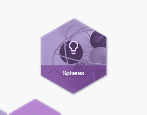
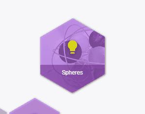
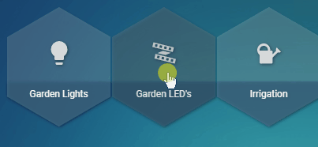

# Honeycomb-Menu for Home Assistant by [@Sian-Lee-SA](http://github.com/Sian-Lee-SA)


[](https://www.buymeacoffee.com/SianLee)

## About

Honeycomb menu is a [Home Assistant](https://www.home-assistant.io/) module (not a card) that can be applied to any lovelace card. When activated by the defined action on said card, the module will display a 'rounded' list of honeycomb buttons with an optional XY pad to make interfacing with lovelace more fluent. This module was designed with [button-card](https://github.com/custom-cards/button-card) by [@RomRider](https://github.com/RomRider) in mind.

The module uses a hierarchy override for honeycomb options and sub options so you can define a templated version of options then define another set of options that will merge / cascade.

> This is still in alpha stages and has only be used and tested in chrome. Please expect errors and bugs otherwise you will be overly frustrated & disappointed!




## Watch YouTube Demonstration

[](https://www.youtube.com/watch?v=oJ9Yr2dSqUk)

## Requirements
1. [Card Tools](https://github.com/thomasloven/lovelace-card-tools)

## How to install
1. Download the [module](https://github.com/Sian-Lee-SA/honeycomb-menu/releases)
1. Place the file into the `config/www` path of your home assistant installation
    > you can place into a sub directory if you have OCD like me :grinning: just remember to point the resource url with the sub path

1. Add the resource to the lovelace config. _There are two ways in doing this_
    1. `yaml` - find your lovelace.yaml then place the following into resources eg.
        ```yaml
            resources:
              - url: /local/{path-to-module}.js
                type: module
        ```
    1. `Web Interface` - (Home Assistant V0.108+):
        1. Goto the configuration page then open `Lovelace Dashboards`
        1. Select the `Resources` tab
        1. Click on the `+` (add) button in the lower right
        1. In the url field, add the module js file path ( Where your Home Assistant config/www/ path is needs to be replaced with /local/).  So a path to a saved file in `homeassistant_path/config/wwww/module.js` would be `/local/module.js` as the url path
        1. Ensure Resource type is left as Javascript Module

## How to use
call-service action, you can call the honeycomb service while passing the config options as the service data without the need for the action option. Any card or module that uses the hass.callService can invoke the honeycomb menu

```yaml
- type: vertical-stack
  cards:
  - type: button
    entity: light.kitchen
    hold_action:
      action: call-service
      service: honeycomb
      service_data:
        template: light
        autoclose: false
        active: true
        ...
```

## `honeycomb:` Options

Option          | Values        | Default   | Details
--              | -             |-          |-
entity | `any:entity_id` | `card:entity` | This will call actions on the entity (entity_id) defined. If omitted then the card entity will be used.
buttons | `list[0-5]`: [Button](#button-options) `\| skip \| break` | `null \| template_buttons` | The buttons are your honeycombs :grinning:. There are a max of 6 buttons that you can define. _* note: list indexes start at `0`_. Matching indexes with **template_buttons** will be overridden. Using the string `skip` on an index will use the `template_button` for that index and the string `break` will instead disable that honeycomb position regardless of the `template_button` value for that index.
active | `true \| false \| template` | `false` | Setting this to true will apply active styles based on the entity it's assigned to. You can also choose to use a template and return a boolean value. See [Templating](#templating)
autoclose | `true \| false` | `true` | Close the menu if a button is pressed
audio | `any:url_path` | `null` | Point to a audio file that will play when a button has been tapped
xy_pad | [XYPad](#xypad-options) | `null` | This will allow the adding of a xy pin in the middle of the honeycombs which can execute a service based on the x or y value
size | `int:px` | `225` | The size in px of the honeycomb menu. Each button item grows with the size
spacing | `int:px` | `2` | This will assign the padding in px for each honeycomb item
variables | `object` | `null` | Variables can be accessed through parent templates and templating code via `variables.foo` with `foo` being the variable name. See [Example](#example-using-variables)
animation_speed | `int` | `100` | Change the speed of the animation to show the menu

## `Button` Options

Option          | Values        | Default   | Details
--              | -             | -         | -
type | `any:card` | `custom:button-card` | The base card to use for the button **Be sure to set the underlying card to 100% height or it may not display correctly**
active | `true \| false` | `honeycomb:active` | Override the honeycomb active property for this button item
show | `true \| false` | `true` | Whether to display this button. If a parent template has an active button for this position then it will show instead. [Templating](#templating) can be used to return a boolean value
autoclose | `true \| false` | `honeycomb:autoclose` | Override the honeycomb autoclose property for this button
audio | `any:url_path` | `honeycomb:audio` | Override the honeycomb audio property for this button
entity | `any:entity_id` | `honeycomb:entity` | You can define the entity that this button targets. Omitted will resort to the honeycombs entity. An entity ca be used in templates by accessing its variable `entity`
position | `int` | `null` | The position index to place the button. This is helpful for overriding template buttons.
icon | `any:icon` | `null` | Only adding here for reference to custom:button-card so you can show an icon for the item
color | `any:css_color` | var(--honeycomb-menu-icon-color) | Color of icon or background (depending on custom:button-card config). Leaving the default value allows the theme to handle the color
show_name | `true \| false` | `false` | Only relevant for cards that support this option
Any other options for `Button:type` | - | - | -

## `XYPad` Options

The x and y properties have the same options. If one of the x or y properties are omitted then the pad will only go the direction that's defined.

The pad can be useful for things like light brightness, color hue rotation, opening and closing shutters or roller doors etc.


Option          | Values        | Default   | Details
--              | -             | -         | -
repeat | `int:ms \| false` | `false` | If the xy pin is moved but idle, then repeat will continue calling the service otherwise the service will only be called when the xy pin is moving
on_release | `true \| false` | `false` | Only call the service when the xy pin has been released while providing the x y value that it was on
x | [XYConfig](#xyconfig) | `null` | See below for properties and values. * `null` will disable x movements
y | [XYConfig](#xyconfig) | `null` | See below for properties and values. * `null` will disable y movements

#### XYConfig
Option          | Values        | Default   | Details
--              | -             | -         | -
invert | `true \| false` | `false` | x or y will swap negative and positive values so moving xy pin up will give a positive value whereas down will give a negative value
service | `any:service` | `null` | The service to call eg. light.turn_on. If this value is omitted then the ball pin will have no effect on this axis
service_data | `dict` | `null` | Provide any service data as a dictionary / object. This property will be processed through the template system allowing access to variables and javascript. See [Templating](#templating).

## Theme Styles and Defaults

Adding the following style properties to your theme `.yaml` file will override the defaults
```css
/* Styles selector is used as a placeholder for syntax highlighting */
styles {
    --honeycomb-menu-icon-color: var(--paper-item-icon-color);
    --honeycomb-menu-icon-active-color: var(--paper-item-icon-active-color);
    --honeycomb-menu-background-color: var(--paper-card-background-color);
    --honeycomb-menu-active-background-color: var(--paper-card-active-background-color, var(--paper-card-background-color));
	--honeycomb-menu-disabled: #9a9a9a6e;
}
```

## Templating
Templating is currently available for all `XYConfig:service_data` properties and some config options. Templating allows flexibility and provide values based on the xy pads positions or config options.

A property only containing the word **entity** will be converted to the `honeycomb:entity` value.

There are two templating syntax's
1. Uses `{{ variable }}` syntax to retrieve the xy pad event variables. These variables come with either a negative or positive values depending on direction from center. * Does not apply to `active` option
        Available variables are:

        x: Pixels from the x center position
        y: Pixels from the y center position
        x_percentage: Percentage of the x position
        y_percentage: Percentage of the y position

1. Uses a modified version of [button-card](https://github.com/custom-cards/button-card) by [@RomRider](https://github.com/RomRider) templating system using the `[[[ return 'some_value' ]]]` syntax (remember to return your values!). Head over to [button-card templates](https://github.com/custom-cards/button-card#templates) for an insight to how this templating system works. Configs with variables defined can be accessed by the `variables` object.

The first template syntax `{{ }}` will be parsed first allowing the [button-card templates](https://github.com/custom-cards/button-card#templates) syntax `[[[  ]]]` parser to work with the actual values from the xy pad. eg.

```javascript
[[[ return {{ x_percentage }} / 10; ]]]
```
_becomes_:

```javascript
[[[ return 50 / 10; ]]]
```
> the second parser would then give the value of `5` based on the example above and `x_percentage = 50`
#### Examples
It's also possible to just use the first parser or second parser without the other. The following example with result in the `service_data:brightness` value to be the actual percentage of the xy pin `x` or `y` value:

> Note: the following service `light.relative_brightnesss` is not a part of Home Assistant but instead is my own custom service that changes a lights brightness relatively. You could achieve the same outcome with the `light.turn_on` service and using the javascript template parser with some calculations

```yaml
...
service: honeycomb
service_data:
  entity: light.kitchen
  xy_pad:
    x:
      invert: true
      service: light.relative_color
      service_data:
        # The word entity will become light.kitchen
        entity_id: entity
        hue: '[[[ return {{ y }} / 18 * {{ y_percentage }}; ]]]'        
    y:
      service: light.relative_brightnesss
      service_data:
        # We can define another entity like normal
        entity_id: light.bathroom
        brightness: '{{ x_percentage }}'
        percentage: true
```

An example for templatable config options could be used to determine a fan state and set the button as active if fan is currently in that state eg...

```yaml
...
service: honeycomb
service_data:
    entity: fan.master_bedroom
    buttons:
      - icon: 'mdi:information-variant'
        tap_action:
          action: more-info
      - icon: 'mdi:fan-speed-1'
        active: '[[[ return entity.attributes.speed == "low" ]]]'
        tap_action:
          action: call-service
          service: fan.set_speed
          service_data:
            entity_id: entity
            speed: low
      - icon: 'mdi:fan-speed-2'
        active: '[[[ return entity.attributes.speed == "medium" ]]]'
        tap_action:
          action: call-service
          service: fan.set_speed
          service_data:
            entity_id: entity
            speed: medium
      - icon: 'mdi:fan-speed-3'
        active: '[[[ return entity.attributes.speed == "high" ]]]'
        tap_action:
          action: call-service
          service: fan.set_speed
          service_data:
            entity_id: entity
            speed: high
```

#### Example using variables
Say you have defined a honeycomb menu template for lights, you can then allow the light template make logical conditions as to how it should render.

edit the honeycomb menu templates file (*don't confuse templating with honeycomb templates)
```yaml
light:
  variables:
    timer: null
    motion: null
  audio: /local/audio/pin-drop.ogg
  xy_pad:
    repeat: 500
    y:
      invert: true
      service: light.turn_on
      service_data:
        entity_id: entity
        brightness_step_pct: '[[[ return {{ y_percentage }} / 10; ]]]'
  buttons:
    - icon: 'mdi:information-variant'
      tap_action:
        action: more-info
    - icon: 'mdi:lightbulb'
      active: true
    - show: '[[[ return (variables.motion) ]]]'
      entity: '[[[ return variables.motion ]]]'
      icon: 'mdi:motion-sensor'
      position: 4
      active: true
      tap_action:
        action: toggle
    - show: '[[[ return (variables.timer) ]]]'
      entity: '[[[ return variables.timer ]]]'
      icon: 'mdi:timer'
      position: 5
      active: true
      tap_action:
        action: toggle
```

With the example above, if a menu derives the light template then any menu that sets a timer or motion as a variable will show those menu items with the entity being set to the variable property. If the variable is not set then it won't show the menu item and instead will either show the next derived item for that item position or nothing.

Below is an example on how to assign a menu to the above example.
```yaml
- type: 'custom:button-card'
  entity: light.back_yard_garden_leds
  hold_action:
    action: call-service
    service: honeycomb
    service_data:
      template: light
      variables:
        motion: automation.motion_back_yard_garden_leds
```

As shown, this allows us to minimize clutter while keeping things neat and consistent.

##### Result


Also note that templates can derive from another template which can also access these variables through the hierarchy
